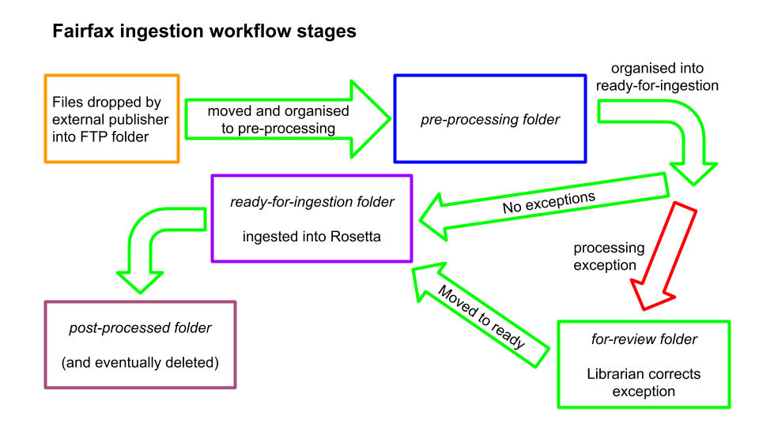

==============
Workflow Guide
==============

Additional TODO
===============

-   Placeholder for additional TODO items.

Introduction
============

About NLNZ Tools SIP Generation Fairfax
---------------------------------------

NLNZ Tools SIP Generation Fairfax is specific set of tools for processing Fairfax-specific content. The ultimate output
of these tools are SIPs for ingestion into the Rosetta archiving system.

This guide documents the workflows involved that move files from being dropped in an FTP folder through to being
ingested into the Rosetta archiving system.

About this document
-------------------

This document is the NLNZ Tools SIP Generation Fairfax Workflow Guide.

The manual is divided into chapters, each of which deals with a particular workflow.

See also:

-   :doc:`librarian-guide`
-   :doc:`script-runner-guide`
-   :doc:`developer-guide`
-   :doc:`faq`

Contents of this document
-------------------------

Following this introduction, this User Guide includes the following sections:

-   **Processing stages** - Covers the different processing stages.

Processing stages
=================

Files moves through the different processing stages. Each processing stage has its own folder structure.

Stages list
-----------
The stages are as follows:

    1. *FTP stage* - this is where files are placed from the file producer.
    2. *Pre-processing stage* - Files are moved from the FTP stage in preparation for processing.
    3. *Ready-for-ingestion stage* - Files are processed and sips are created. This stage is where files are ingested into
       Rosetta.
    4. *Ingested stage* - Files have been ingested into Rosetta.
    5. *For-review stage* - Exceptions or issues with the files means that a review is necessary before the files can be
       moved to the correct stage.

Stages diagram
--------------
The following diagram illustrates the workflow.

|diagramFairfaxIngestionWorkflow|

Process a single stage at a time
--------------------------------
While it is possible to multiple processing stages in the same run, note that they often the same ``sourceFolder`` and
``targetFolder`` parameters. The source and target folders have different structures and different purposes, so we
recommend running a single stages at a time.

